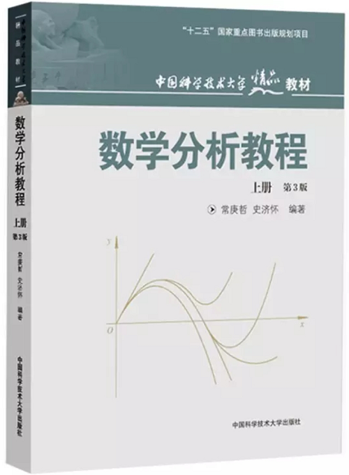
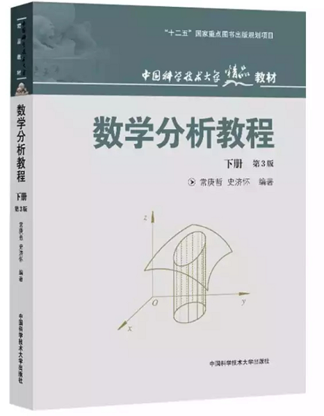
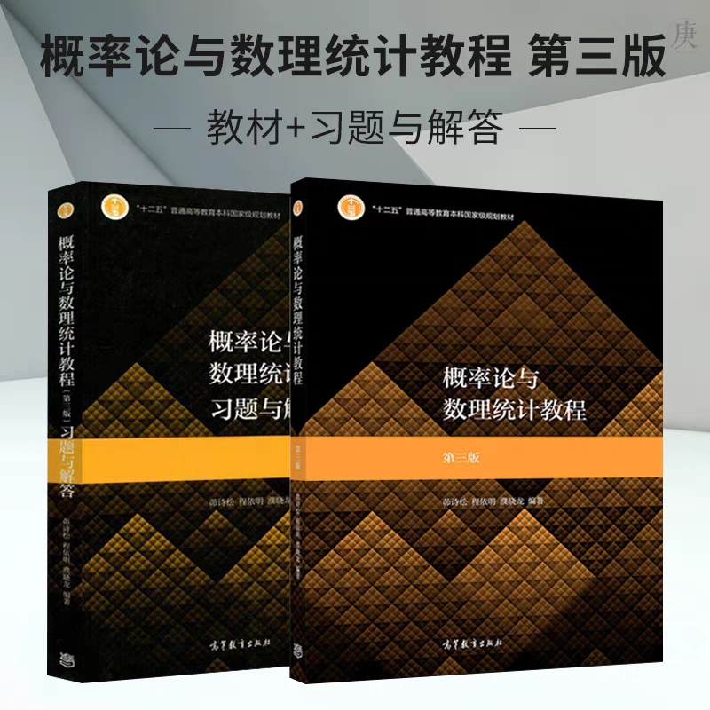
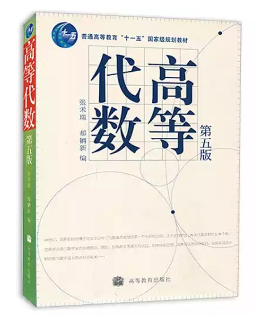

---
title:研一机器学习查漏补缺笔记
---

[toc]

# 前言

自地学跨入人工智能研究生已一年有余，深感荒废时光，基础不扎实，故在此整理，查漏补缺

# 一、数学部分

## 1、数学分析（上）

选用教材为数学专业师兄推荐：

## 2、数学分析（下）

## 3、概率论与数理统计

选用教材为茆诗松所著

## 4、高等代数

选用教材为结构与本科教材类似

# 二、计算机基础部分

跨专业而来，念及要对整个计算机从底层到上层有个整体认知，及本身兴趣，故有此部分

## 1、计算机组成原理

## 2、编译原理

## 3、计算机网络

## 4、Linux系统

## 5、C++编程及面向对象

# 三、深度学习部分

## 1、有关术语

有关术语包括训练时

[机器学习相关术语](深度学习部分/机器学习相关术语.md )

## 2、Python

[python 相关笔记](深度学习部分/python/Readme.md)
