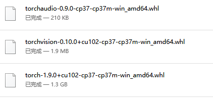
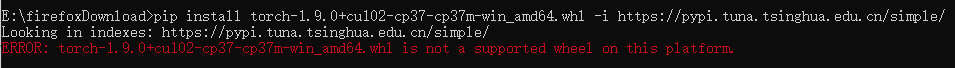
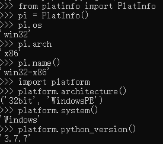
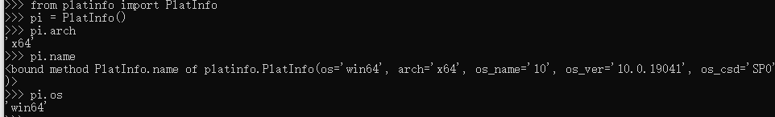

---

title: python
---

[toc]

[返回主目录](../../Readme.md)


# 一、环境配置


## pip

```
# 安装，可指定版本号
pip install chest==0.2.3
 
# 升级
pip install redis--upgrade
 
# 一次安装多个
pip install redis fabric virtualenv
 
# 从文本中安装，文本中为包名，一行一个，可以指定版本号
# 格式为：报名==版本号 比如 greenlet==0.4.10
pip install –r requirements.txt
 
# 删除
 pip uninstall xlrd
 
# 导出当前已经安装包
pip freeze > requirements.txt
```


## virtualenv

  通过pip安装virtualenv：

```
pip install virtualenv
```

virtualenv命令 是将某个python.exe环境拷贝到一个新的目录环境

```
C:\Users\Administrator>virtualenv --help
Usage: virtualenv [OPTIONS] DEST_DIR
 
Options:
  --version             show program's version number and exit
  -h, --help            show this help message and exit
  -v, --verbose         Increase verbosity.
  -q, --quiet           Decrease verbosity.
  -p PYTHON_EXE, --python=PYTHON_EXE

```


####  创建环境

```
virtualenv --no-site-packages venv
```

命令`virtualenv`就可以创建一个独立的Python运行环境，我们还加上了参数`--no-site-packages`，这样，已经安装到系统Python环境中的所有第三方包都不会复制过来，这样，我们就得到了一个不带任何第三方包的“干净”的Python运行环境。

新建的Python环境被放到当前目录下的`venv`目录。有了`venv`这个Python环境，可以用`source`进入该环境：

```
source venv/bin/activate
```

在`venv`环境下，用`pip`安装的包都被安装到`venv`这个环境下，系统Python环境不受任何影响。也就是说，`venv`环境是专门针对`myproject`这个应用创建的。

退出当前的`venv`环境，使用`deactivate`命令：


  用pip freeze查看当前安装版本

```
pip freeze
```

  另外：

```
pip freeze > requirements.txt
```

  这将会创建一个 `requirements.txt` 文件，其中包含了当前环境中所有包及 各自的版本的简单列表。您可以使用 “pip list”在不产生requirements文件的情况下，  查看已安装包的列表。这将会使另一个不同的开发者（或者是您，如果您需要重新创建这样的环境） 在以后安装相同版本的相同包变得容易。

```
pip install -r requirements.txt
```

  这能帮助确保安装、部署和开发者之间的一致性。

## virtualenvwrapper

### 1 Linux安装

virtualenvwrapper 时一个基于virtualenv之上的工具，它将所欲的虚拟环境统一管理。

安装：

    $ sudo pip install virtualenvwrapper

virtualenvwrapper默认将所有的虚拟环境放在～/.virtualenvs目录下管理，可以修改环境变量WORKON_HOME来指定虚拟环境 的保存目录。

使用如下命令来启动virtualenvwrapper：

    $ source /usr/local/bin/virtualenvwrapper.sh

还可以将该命令添加到/.bashrc或/.profie等shell启动文件中，以便登陆shell后可直接使用virtualenvwrapper提供的命令。

对于virtualenvwrapper的配置：

代码如下：

    if [ `id -u` != '0' ]; then
    
      export VIRTUALENV_USE_DISTRIBUTE=1        # <-- Always use pip/distribute
      export WORKON_HOME=$HOME/.virtualenvs       # <-- Where all virtualenvs will be stored
      source /usr/local/bin/virtualenvwrapper.sh
      export PIP_VIRTUALENV_BASE=$WORKON_HOME
      export PIP_RESPECT_VIRTUALENV=true
    
    fi


将上面的配置添加到 ~/.bashrc 的末尾，然后将下面的命令运行一次：

```
source ~/.bashrc
```

### 2 Windows安装

```
pip install virtualenvwrapper-win

#linux安装 pip install virtualenvwrapper
```

默认创建的虚拟环境位于C:\Users\username\envs,可以通过环境变量 WORKON_HOME 来定制。

通过计算机–>属性–>高级系统设置–>环境变量–>在系统变量中新建“变量名”：WORKON_HOME,变量值：“你自定义的路径”。

Win10配置好环境变量后需要重启生效

路径可以由你自己选择
 

用法


 WORK_HOME

```
echo %WORKON_HOME%
```


    # 创建虚拟环境
    mkvirtualenv env27
    
    # 创建指定解释器的虚拟环境
    mkvirtualenv -p python3.4 env34
    
    # 创建指定解释器的虚拟环境
    workon env27
    
    # 退出虚拟环境
    deactivate
    
    # 删除虚拟环境
    rmvirtualenv env27
    
    # 列出可用的运行环境
    lsvirtualenv
    
    # 列出当前环境安装了的包
    lssitepackages


## 包安装

whl 格式：这是一个压缩包，在其中包含了py文件，以及经过编译的pyd文件。

这个格式可以使文件在不具备编译环境的情况下，选择合适自己的python环境进行安装

#### 通过whl安装pytorch

Torch whl下载地址：

https://download.pytorch.org/whl/torch_stable.html

1.第一步：去pytorch的whl下载的地址下载官网给的命令中的torch和torchvision的版本的whl

(注意cpu 和 cuda版本区别)



2.第二步：用pip list查一下你有没有wheel这个库，一般是肯定有的，可以去确认一下

3.第三步：和一般用pip安装类似，不过这次是直接用whl文件,切记，此时要先安装torch，再去安装torchvision,否则也会报错。下面以安装torch的命令为例，cmd进入你torch的whl存放的目录，然后执行下面的命令。

```cpp
pip install torch-1.9.0+cu102-cp37-cp37m-win_amd64.whl -i https://pypi.tuna.tsinghua.edu.cn/simple/

pip install torchvision-0.10.0+cu102-cp37-cp37m-win_amd64.whl -i https://pypi.tuna.tsinghua.edu.cn/simple/

pip install torchaudio-0.9.0-cp37-cp37m-win_amd64.whl -i https://pypi.tuna.tsinghua.edu.cn/simple/
```

这里我用命令临时改成了清华的下载源，因为虽然这里已经把torch的whl下载了，但是它有可能要下载其他的库，所以用国内源下载还是会快很多。安装好torch后，接着安装torchvision就可以了。



出现这个问题，是由于这个whl**和系统python版本不匹配**导致的。

#### 查看python支持的whl

较新版本的pip**无效的方法**。

```
import pip._internal
print(pip._internal.pep425tags.get_supported())
print(pip.pep425tags.get_supported())
# 均为旧版pip的教程，并不适用于pip 20.0及以上版本，甚至不适用于临近pip 20.0的版本。使用上述旧教程，会得到pip has no attribute pep425tags。
```

**直接在命令行中输入，不要在Python解释器输入哦**：

```
pip debug --verbose
```

从中我们可以看到**Compatible tags**字样，这些就是当前Python版本可以适配的标签。

#### 检测底层操作系统平台

首先查看python版本

cmd打开命令行，输入python，查看。

如果32bit，则是32位；如果是64，则是64位


 


```
from platinfo import PlatInfo 
pi = PlatInfo()
pi.os
pi.arch
pi.name()

import platform
platform.architecture()
```

对于32位，`pi.name()`返回`win32-x86`






注意：

- 若安装的为32位python,则在python中无论如何检测都是32位Win

- 无论基础Windows系统的位数与python版本位数如何，`sys.platform`都将是`win32`


#### requirements.txt

```
pip freeze` or `pip list
```

导出requirements.txt

```
pip freeze > <目录>/requirements.txt
```

安装包

在线安装

```
pip install <包名>` 或 `pip install -r requirements.txt
```


#### 安装dgl

```
pip install dgl           # For CPU Build
pip install dgl-cu90      # For CUDA 9.0 Build
pip install dgl-cu92      # For CUDA 9.2 Build
pip install dgl-cu100     # For CUDA 10.0 Build
pip install dgl-cu101     # For CUDA 10.1 Build
```

若先安装dgl, 再安装dgl-cuxx，将dgl卸载，则import dgl会报错，需要先将dgl卸载再install dgl-cuxx


# 二、机器学习相关


## 稀疏数据处理

### coo

coo_matrix: 坐标格式的矩阵(Coodrdinate format matrix)

优点：

    不同稀疏格式间转换效率高(exp:CSR/CSC)
    coo_matrix不支持元素的存取和增删，一旦创建之后，除了将之转换成其它格式的矩阵，几乎无法对其做任何操作和矩阵运算。
    构建矩阵时，允许坐标重复
缺点：

1. 不能直接运算
2. 不能直接切片操作


### csc

csc_matrix: 压缩稀疏列矩阵(Compressed sparse column matrix)

优点：

1. 高效的矩阵加法与乘法内积运算
2. 高效的列切片操作

缺点：

1. 矩阵内积操作没有CSR快
2. 行切片操作慢（相比CSR)
3. 转换成稀疏结构成本高（相比LIL)


### csr

csr_matrix: 压缩稀疏行矩阵(Compressed sparse row matrix)

优点：

    高效的矩阵加法与乘法内积运算
    高效的行切片操作
    CSR格式在存储稀疏矩阵时非零元素平均使用的字节数(Bytes per Nonzero Entry)最为稳定（float类型约为8.5，double类型约为12.5）CSR格式常用于读入数据后进行稀疏矩阵计算。

缺点：

    列切片操作慢（相比CSC)
    转换成稀疏结构成本高（相比LIL)


### lil

lil_matrix:基于行连接存储的稀疏矩阵(Row-based linked list sparse matrix)

优点：

1. 快速按行切片
2. 高效地添加、删除、查找元素

缺点:

1. 按列切片很慢（建议CSC）
2. 算术运算LIL+LIL很慢（考虑CSR或CSC）


## optuna 自动调参

```
pip install optuna
```

**study**：根据目标函数的优化Session,由一系列的trail组成。
 **trail**：根据目标函数作出一次执行。

 study 的学习目标就是根据多次trail得到的结果发现其中最优的超参数。

简单示例：

```python
import optuna
from torch import optim, nn

'''
# 这个定义的model只是个示例，实际并没什么用
class model(nn.Module):

    def __init__(self, input_size, output_size, hidden_size=200, dropout=p):
        super(model, self).__init__()
        self.embedding = nn.Embedding(num_embeddings=input_size,
                                      embedding_dim=hidden_size)
        self.linear = nn.Linear(in_features=hidden_size, out_features=output_size)
        self.dropout = nn.Dropout(dropout)
    def forward(self, x):
    	x = self.dropout(self.embedding(x))
        outputs = self.linear(x)
        return outputs
'''

def define_model(trial):
    # 在100到200之间搜索hidden_size
    hidden_size = trial.suggest_int('hidden_size', 100, 200)
    # 在0.2到0.5之间搜索dropout rate
    p = trial.suggest_uniform('dropout', 0.2, 0.5)
    # 假设vocab_size, output_size都已经定义了
    m = model(input_size=vocab_size, output_size=output_size, 
              hidden_size=hiddensize, dropout=p)
    return m

def objective(trial):
    # 尝试不同的optimizer
    optimizer_name = trial.suggest_categorical('optimizer', 
                                               ['Adam', 'RMSprop', 'SGD'])
    # 搜索学习率
    lr = trial.suggest_uniform('lr', 1e-5, 1e-1)
    m = define_model(trial)
    optimizer = getattr(optim, optimizer_name)(m.parameters(), lr=lr)
    # 这里省略了run函数，内部应该将数据喂给model训练，训练完成后在验证集上测试，计算并返回acc
    acc = run(m, optimizer=optimizer)
    return acc

if __name__ == '__main__':
    # 创建一个学习实例，因为objective返回的评价指标是acc，因此目标是最大化，如果是loss就该是minimize
    study = optuna.create_study(direction='maximize')
    # n_trials代表搜索100种，n_jobs是并行搜索的个数，-1代表使用所有的cpu核心
    study.optimize(objective, n_trials=100, n_jobs=-1)
    print('Number of finished trials: ', len(study.trials))
    print('Best trial:')
    trial = study.best_trial
    print('  Value: ', trial.value)
    print('  Params: ')
    for key, value in trial.params.items():
        print('    {}: {}'.format(key, value))
```


官方示例：

```python
import ...

# Define an objective function to be minimized.
def objective(trial):

    # Invoke suggest methods of a Trial object to generate hyperparameters.
    regressor_name = trial.suggest_categorical('classifier', ['SVR', 'RandomForest'])
    if regressor_name == 'SVR':
        svr_c = trial.suggest_float('svr_c', 1e-10, 1e10, log=True)
        regressor_obj = sklearn.svm.SVR(C=svr_c)
    else:
        rf_max_depth = trial.suggest_int('rf_max_depth', 2, 32)
        regressor_obj = sklearn.ensemble.RandomForestRegressor(max_depth=rf_max_depth)

    X, y = sklearn.datasets.load_boston(return_X_y=True)
    X_train, X_val, y_train, y_val = sklearn.model_selection.train_test_split(X, y, random_state=0)

    regressor_obj.fit(X_train, y_train)
    y_pred = regressor_obj.predict(X_val)

    error = sklearn.metrics.mean_squared_error(y_val, y_pred)

    return error  # An objective value linked with the Trial object.

study = optuna.create_study()  # Create a new study.
study.optimize(objective, n_trials=100)  # Invoke optimization of the objective function.
```


## 训练网络模型

创建一个类为网络结构，另外创建一个类，构建方法来实现数据导入、训练参数


load方法导入数据，一般在该类初始化时直接调用该方法

```
def load_data(self, adj, adj_eval, features, labels, tvt_nids):
    if isinstance(features, torch.FloatTensor):
        self.features = features
    else:
        self.features = torch.FloatTensor(features)
    if self.features.size(1) in (1433, 3703):
        self.features = F.normalize(self.features, p=1, dim=1)
    if len(labels.shape) == 2:
        labels = torch.FloatTensor(labels)
    else:
        labels = torch.LongTensor(labels)
    self.labels = labels
    if len(self.labels.size()) == 1:
        self.n_class = len(torch.unique(self.labels))
    else:
        self.n_class = labels.size(1)
    self.train_nid = tvt_nids[0]
    self.val_nid = tvt_nids[1]
    self.test_nid = tvt_nids[2]
    # adj for training
    assert sp.issparse(adj)
    if not isinstance(adj, sp.coo_matrix):
        adj = sp.coo_matrix(adj)
    adj.setdiag(1)
    self.adj = adj
    adj = sp.csr_matrix(adj)
    self.G = DGLGraph(self.adj)
    # adj for inference
    assert sp.issparse(adj_eval)
    if not isinstance(adj_eval, sp.coo_matrix):
        adj_eval = sp.coo_matrix(adj_eval)
    adj_eval.setdiag(1)
    adj_eval = sp.csr_matrix(adj_eval)
    self.adj_eval = adj_eval
    self.G_eval = DGLGraph(self.adj_eval)
```


fit方法训练模型参数

```
def fit(self):
    optimizer = torch.optim.Adam(self.model.parameters(),
                                 lr=self.lr,
                                 weight_decay=self.weight_decay)
    # data
    features = self.features.to(self.device)
    labels = self.labels.to(self.device)
    # loss function for node classification
    if len(self.labels.size()) == 2:
        nc_criterion = nn.BCEWithLogitsLoss()
    else:
        nc_criterion = nn.CrossEntropyLoss()

    best_vali_acc = 0.0
    best_logits = None
    for epoch in range(self.epochs):
        if self.dropedge > 0:
            self.dropEdge()
        self.model.train()
        logits = self.model(self.G, features)
        # losses
        # l = F.nll_loss(logits[self.train_nid], labels[self.train_nid])
        l = nc_criterion(logits[self.train_nid], labels[self.train_nid])
        optimizer.zero_grad()
        l.backward()
        optimizer.step()
        # validate (without dropout)
        self.model.eval()
        with torch.no_grad():
            logits_eval = self.model(self.G_eval, features).detach().cpu()
        vali_acc, _ = self.eval_node_cls(logits_eval[self.val_nid], labels[self.val_nid].cpu())
        if self.print_progress:
            print('Epoch [{:2}/{}]: loss: {:.4f}, vali acc: {:.4f}'.format(epoch+1, self.epochs, l.item(), vali_acc))
        if vali_acc > best_vali_acc:
            best_vali_acc = vali_acc
            best_logits = logits_eval
            test_acc, conf_mat = self.eval_node_cls(logits_eval[self.test_nid], labels[self.test_nid].cpu())
            if self.print_progress:
                print(f'                 test acc: {test_acc:.4f}')
    if self.print_progress:
        print(f'Final test results: acc: {test_acc:.4f}')
    del self.model, features, labels, self.G
    torch.cuda.empty_cache()
    gc.collect()
    t = time.time() - self.t
    return test_acc, best_vali_acc, best_logits
```

### one-hot 编码

**numpy快速生成one hot编码**

np.eye生成M*N矩阵，后面跟的数组说明1偏移的位置

```python
num_class = 6
labels = np.eye(labels.shape[0],num_class)[labels]
```


### 查看变量占用内存

```python
def show_memory(unit='KB', threshold=1):
    '''查看变量占用内存情况

    :param unit: 显示的单位，可为`B`,`KB`,`MB`,`GB`
    :param threshold: 仅显示内存数值大于等于threshold的变量
    '''
    from sys import getsizeof
    scale = {'B': 1, 'KB': 1024, 'MB': 1048576, 'GB': 1073741824}[unit]
    for i in list(globals().keys()):
        memory = eval("getsizeof({})".format(i)) // scale
        if memory >= threshold:
            print(i, memory)
```


## 梯度爆炸

梯度和loss都会变为nan。一般情况下，梯度变为nan都是出现了 $$log(0), \frac{x}{0}$$ ![[公式]](https://www.zhihu.com/equation?tex=%5Clog%280%29) , ![[公式]](https://www.zhihu.com/equation?tex=%5Cfrac%7Bx%7D%7B0%7D) 等情况，导致结果变为+inf，也就成了nan。

可能原因：

- 学习率过大；
- `loss`过小（或者说除以了0 / 计算了 `log(0)`）；
- 存在脏数据输入`NaN`。可以用numpy.isnan或者tensor.isnan().sum()检查

- target 存在 inf
