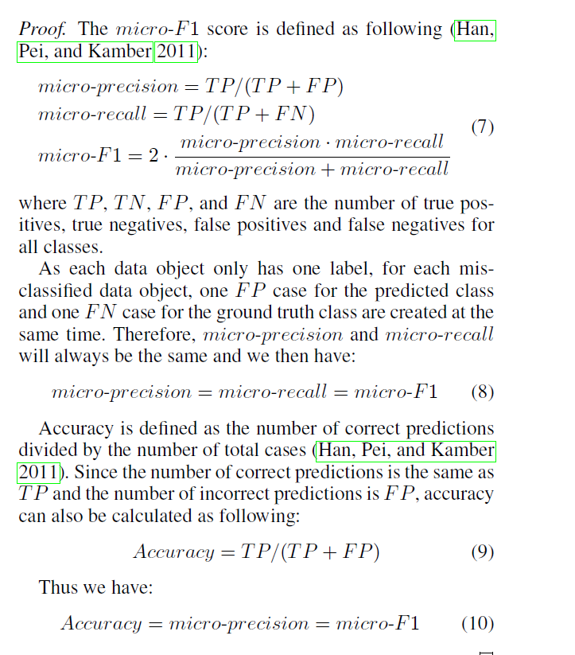

---
title:机器学习相关术语
---

[toc]

[返回主目录](../研一机器学习查漏补缺笔记.md)


# 一、评价指标


**TP**（True Positive）：预测答案正确

**FP**（False Positive）：错将其他类预测为本类

**FN**（False Negative）：本类标签预测为其他类标

**TN**（True Negative） ：预测为负、实际也为负。

精准度 / 查准率(precision)：指被分类器判定正例中的正样本的比重

$$
precision_{k}=\frac{TP}{TP+FP}
$$
召回率 / 查全率 (recall)：指的是被预测为正例的占总的正例的比重

$$
recall_{k}=\frac{TP}{TP+FN}
$$
举个例子，黄色部分是‘癌症患者’，阴影部分是‘判断为癌症的患者’。那么阴影与黄色重叠的部分，就是正确判断‘患癌症’的病例；白色阴影，则是‘误判为癌症’的病例。


Precision衡量是否有误判：A+C是模型判断‘患癌症’的病人，A是其中真正‘患癌症’的病人，那Precision就是，模型判定‘患病’的准确度。

Recall用来衡量是否有遗漏：A+B是所有真实患癌症的病人，A是模型筛查出患病的病人。

### 1. F1-score

F1分数（F1-score）是分类问题的一个衡量指标。一些多分类问题的机器学习竞赛，常常将F1-score作为最终测评的方法。它是精确率和召回率的调和平均数，最大为1，最小为0。

re(以下简称F1)是用来评价二元分类器的度量，它的计算方法如下:

$$
F_{1}=\frac{2}{\frac{1}{precision}+\frac{1}{recall}}=2\cdot \frac{precision\cdot recall}{precision+recall}
$$
我们定义$$F_{\beta}$$ 分数为：
$$
F_{\beta} = (1+\beta^2)\cdot \frac{precision\cdot recall}{\beta^2 \cdot precision+recall}
$$


除了F1分数之外，F0.5分数和F2分数，在统计学中也得到了大量应用，其中，F2分数中，召回率的权重高于精确率，而F0.5分数中，精确率的权重高于召回率。

### 2.accuracy

常用的准确率(accuracy)的概念，代表分类器对整个样本判断正确的比重。
$$
accuracy=\frac{TP+TN}{TP+TN+FP+FN}
$$

### 3.micro / macro F1-score

对每个“类”，计算F1，显然我们需要把所有类的F1合并起来考虑。

这里有两种合并方式：

第一种计算出所有类别总的Precision和Recall，然后计算F1,这种方式被称为Micro-F1微平均。

第二种方式是计算出每一个类的Precison和Recall后计算F1，最后将F1平均,这种范式叫做Macro-F1宏平均。

调用sklearn的api进行验证：

```python
from sklearn.metrics import classification_report
print(classification_report([0,0,0,0,1,1,1,2,2], [0,0,1,2,1,1,2,1,2]))
             precision    recall  f1-score   support

          0       1.00      0.50      0.67         4
          1       0.50      0.67      0.57         3
          2       0.33      0.50      0.40         2

avg / total       0.69      0.56      0.58         9
```

```python
from sklearn.metrics import f1_score
f1_score([0,0,0,0,1,1,1,2,2], [0,0,1,2,1,1,2,1,2],average="micro")
0.5555555555555556
```

```python
from sklearn.metrics import f1_score
f1_score([0,0,0,0,1,1,1,2,2], [0,0,1,2,1,1,2,1,2],average="macro")
0.546031746031746
```

micro-F1 score is mathematically equivalent to accuracy (proof in Appendix A.2).(AAAI2021论文)


